# ccExpedition — Presentación de producto

Documento para presentar **qué hace la app**, **para qué sirve** y **cómo se organiza** el control de finanzas personales. Incluye capturas del modo demo (`/demo`).

> **Nota:** el `README.md` del repo es el template de Vite. Este archivo es el resumen funcional del producto.

---

## ¿Qué es ccExpedition?

**ccExpedition** es una web app (instalable como PWA) para **ver cuánto debés mes a mes**, **proyectar cuotas y suscripciones**, y **saber cuánta plata te queda** sin abrir el banco.

No reemplaza al home banking: complementa la planificación con una grilla clara, proyección a futuro y un saldo vivo que baja a medida que registrás gastos del día.

---

## El problema que resuelve

| Sin ccExpedition | Con ccExpedition |
|------------------|------------------|
| Tarjetas, préstamos y suscripciones repartidos en resúmenes y apps distintas | Todo en una grilla mensual |
| No sabés cuánto te queda después de los fijos | **Saldo** = ingreso − compromisos − gastos variables |
| Los gastos en efectivo se pierden | Ítems de **gastos variables** (super, cine, panadería…) restan del saldo |
| Difícil especular el año | Cuotas, cargos mensuales y proyección mes a mes |

---

## Modelo mental: dos capas de gasto

La app separa dos categorías principales. Entender esto es clave para usarla bien.

### 1. Compromisos fijos mensuales (la idea original)

Todo lo que **ya sabés o podés proyectar** cada mes:

- **Tarjetas de crédito** — cuotas de compras, resumen del mes
- **Préstamos** — mismo motor de cuotas, otro nombre de ítem
- **Suscripciones** — Netflix, Spotify (cargo mensual sobre la tarjeta)
- **Alquiler u otros fijos** — podés crear un ítem «Alquiler» con 12 cuotas para especular el año aunque el monto varie un poco

Estos ítems **suman en la fila de totales** y definen **cuánto tenés que pagar** en cada mes.

### 2. Gastos variables del mes (lo nuevo)

Lo que **va pasando** y no es deuda de tarjeta:

- Super, panadería, comida de los gatos, cine, salidas, gustitos en efectivo

Se cargan en ítems marcados como **«Gastos variables»**. No suman al total de tarjetas; **restan del Saldo** para mostrar cuánto te queda disponible.

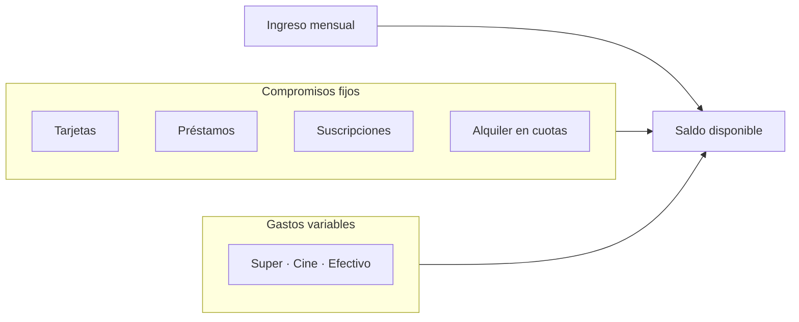

**Fórmula del saldo:**

```
Saldo = Ingreso mensual − (deuda de tarjetas/ítems fijos + gastos variables del mes)
```

---

## Vista principal — Mi futuro (grilla consolidada)

La pantalla central muestra **todas las tarjetas e ítems** en una grilla mes a mes: pasado, presente y futuro proyectado.


**Incluye:**

- **Chips de tarjetas/ítems** — filtrar por Visa, Master, Super, Cine, etc.
- **Chip «Todas las tarjetas»** — deuda pendiente agregada (sin gastos variables)
- **Totales mensuales** — suma de compromisos fijos; meses que superan el límite se resaltan
- **Fila Pagado** — marcar tarjetas pagadas por mes (con pago total o parcial)
- **Ingreso mensual** — editable por mes
- **Saldo** — verde si te sobra, rojo si te falta
- **Detalle por celda** — tocar un mes muestra desglose de cuotas y adelantos

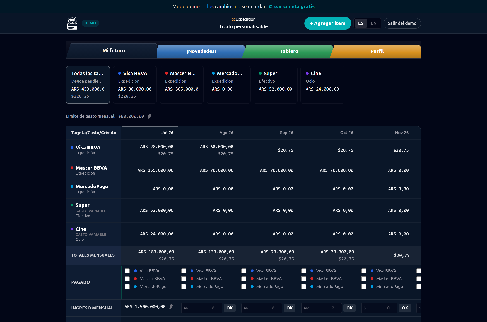

---

## Detalle por tarjeta o ítem

Al elegir un chip (ej. Visa BBVA) ves los gastos del mes: cuotas, montos ARS/USD, categoría, editar y eliminar.

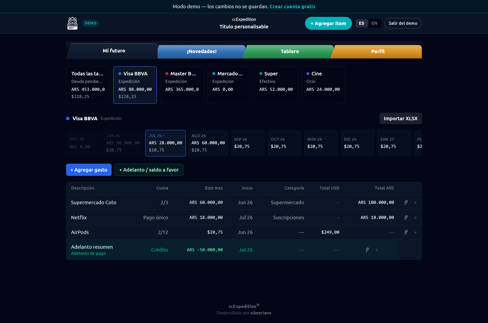

**Acciones por ítem:**

- **+ Agregar gasto** — cuotas, pago único o suscripción
- **+ Adelanto / saldo a favor** — resta del total del mes elegido
- **Importar XLSX** — resumen bancario o lista de compras

---

## Tipos de gasto

### Cuotas

Compras en 2–48 cuotas. Podés cargar el **total** o el **monto de cada cuota**; la app calcula el otro (útil con el resumen del banco).

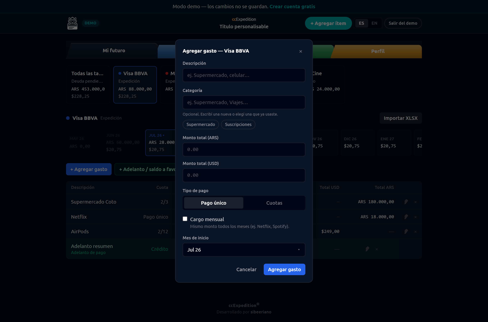

### Suscripciones / cargo mensual

Pago único + **cargo mensual** + duración en meses (Netflix, Spotify en el demo).

### Pago único

Un solo mes — cena, compra puntual en tarjeta.

### Gastos variables

Ítem con checkbox **«Gastos variables»** al crearlo (Super, Cine…). Formulario **rápido**: mes actual, pago único, sin cuotas.

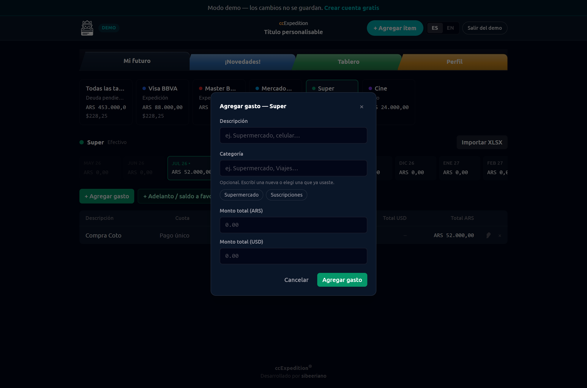

Badge **«Gasto variable»** en la grilla; restan del saldo sin mezclarse con Visa/Master.

---

## Tablero — gastos por categoría

Vista **Tablero**: todos los gastos del mes agrupados por categoría (Supermercado, Suscripciones, Otros…).

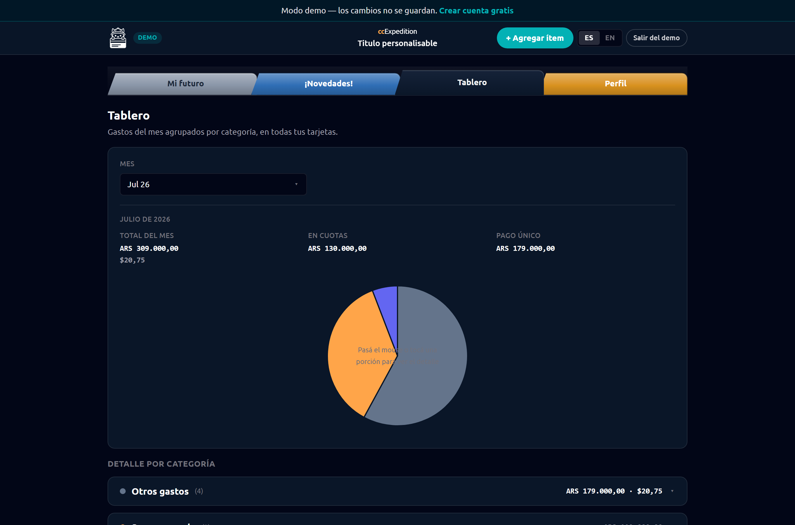

- Gráfico de torta por categoría
- Detalle expandible con cada gasto y su tarjeta origen
- Selector de mes

---

## Perfil — personalización y ajustes

Todo en **Perfil** (antes repartido en ajustes sueltos): apariencia, preferencias, tarjetas, cuenta y ayuda.

### Apariencia

- **Tema visual** (4 opciones — ver abajo)
- **Título del workspace** — texto bajo el logo en el navbar
- **Colores avanzados** (tema Expedición): fondo, tabs, alerta de límite, columna de la grilla
- Vista previa en vivo al cambiar

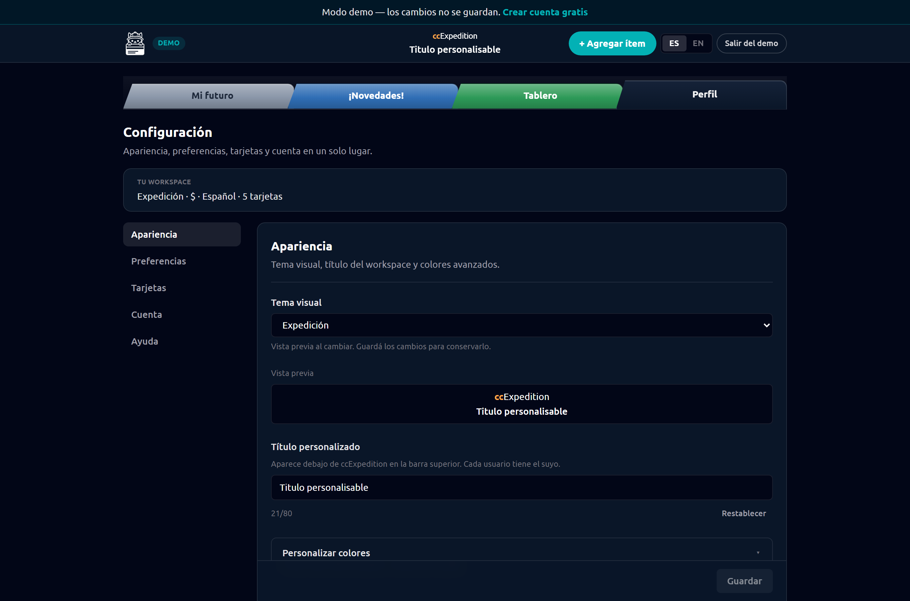

### Preferencias

- **Idioma** — español (default) e inglés
- **Moneda de alerta** — $, €, ARS
- **Mostrar meses anteriores** y **fila Pagado**
- **Cotización USD** — oficial, tarjeta o blue (dolarapi.com), compra/venta del día
- **Convertir USD a pesos** en toda la app
- **Exportar CSV** — en desarrollo («Próximamente»)

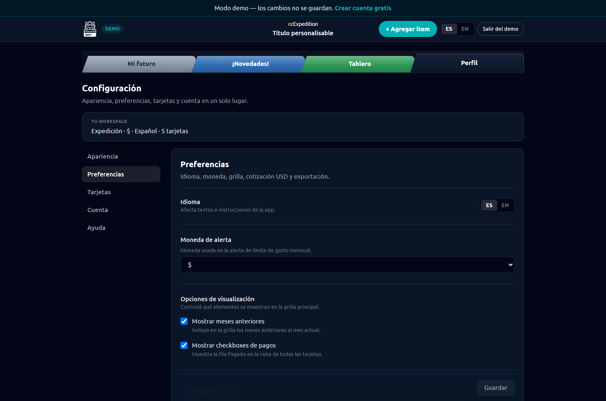

### Tarjetas

Editar nombre, titular, colores o eliminar ítems desde un solo lugar.

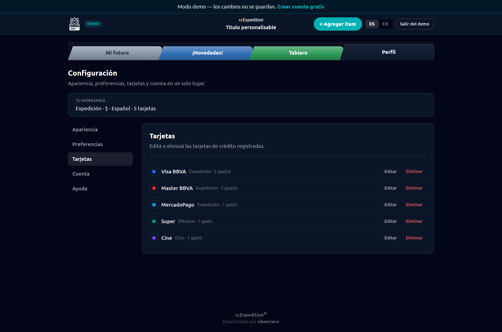

### Cuenta y ayuda

- Email, sesión, cambio de contraseña, eliminar cuenta
- **Repetir tutoriales** guiados (welcome, grilla, detalle de tarjeta)

---

## Temas visuales

Cuatro temas en **Perfil → Apariencia → Tema visual**:

| Tema | Descripción |
|------|-------------|
| **Expedición** | Default oscuro; colores del workspace personalizables |
| **Retro (Windows 95)** | Grises clásicos, bordes en relieve, scrollbars retro |
| **Neobrutalism** | Fondo claro, bordes negros gruesos, sombras duras, tabs de colores |
| **Liquid Glass** | Estilo macOS: paneles translúcidos, blur, acento azul sistema |

En temas preset (Win95, Neo, Glass) los colores del workspace quedan fijos; **la columna de tarjetas en la grilla** sigue siendo editable.

### Expedición


### Retro Windows 95


### Neobrutalism


### Liquid Glass


---

## Conversión USD → ARS

Para gastos en dólares (ej. AirPods en el demo):

- Elegís tipo de cambio en **Perfil → Preferencias**
- Cotización del día con compra y venta
- En detalle de tarjeta: cuota en USD y equivalente en pesos en **Total ARS**
- La grilla y el **Saldo** usan la conversión cuando está activada

---

## Novedades

Sección **Novedades** con changelog ilustrado: cada release explica cambios con texto e imágenes ampliables en lightbox.

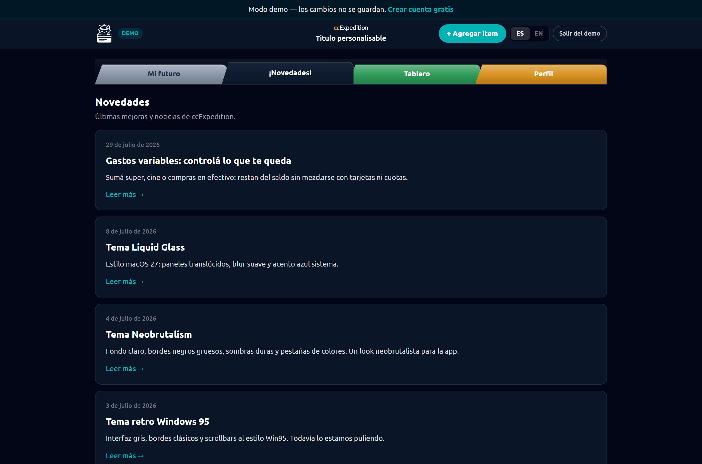

---

## Landing y modo demo

- **Landing** pública con propuesta de valor, pasos «cómo funciona» y acceso beta
- **Modo demo** (`/demo`) — workspace precargado; los cambios no persisten al recargar

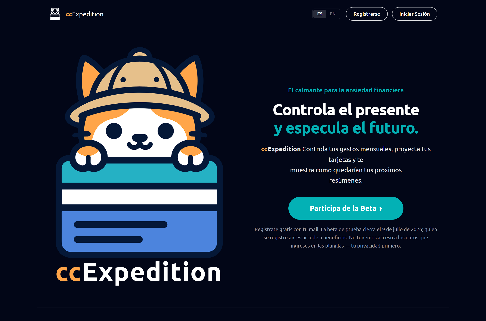

---

## Otras capacidades

| Feature | Detalle |
|---------|---------|
| **PWA** | Instalable en Android/iOS desde el navegador |
| **i18n** | Español e inglés en toda la interfaz |
| **Categorías** | Etiquetas libres en cada gasto; alimentan el Tablero |
| **Límite de gasto mensual** | Tope editable; meses que lo superan se resaltan |
| **Adelantos** | Pagos adelantados o saldo a favor por tarjeta/mes |
| **Import XLSX** | Por tarjeta: resumen bancario o lista de compras |
| **Tutoriales** | Onboarding guiado para usuarios nuevos |

---

## Stack técnico (referencia)

React 19 · Vite · TypeScript · Tailwind v4 · Supabase (auth + datos) · PWA · i18next

---

## Regenerar capturas

Con el dev server en `http://localhost:5173`:

```bash
npm run dev
node scripts/capture-presentacion.mjs
```

Las imágenes se guardan en `docs/presentacion/assets/`.

Capturas adicionales de novedades (gastos variables en grilla):

```bash
node scripts/capture-gastos-mensuales-news.mjs
# → public/news/
```

## Exportar a PDF

Requiere conexión a internet la primera vez (carga marked y Mermaid desde CDN):

```bash
npm run presentacion:pdf
```

Genera **`docs/presentacion/PRESENTACION.pdf`** con texto, imágenes embebidas y el diagrama Mermaid.

---

## Resumen en una frase

**ccExpedition te muestra cuánto debés en lo fijo (tarjetas, préstamos, suscripciones, alquiler proyectado), cuánto te queda después de pagarlo, y te deja ir anotando los gastos variables del mes para no perder de vista la plata disponible.**

---

*Última actualización: julio 2026 — beta ccExpedition*
